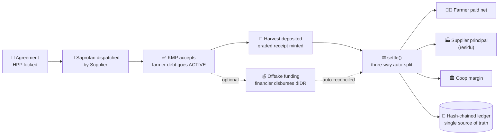
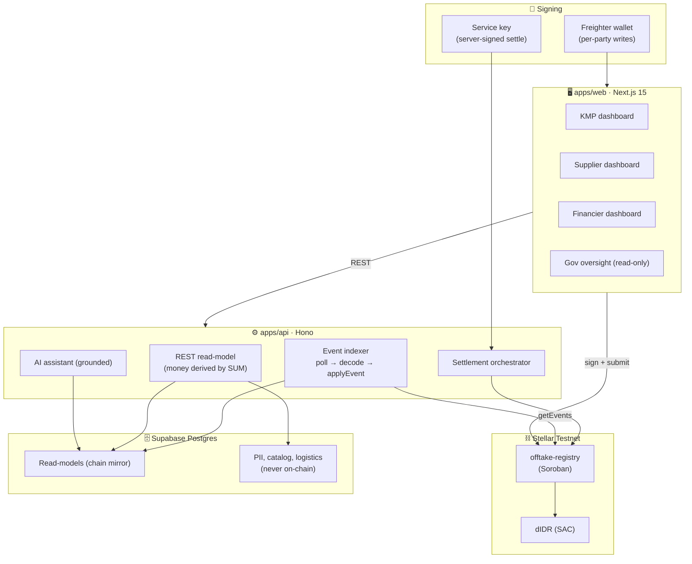

<div align="center">


### The Agricultural Offtake Settlement Rail on Stellar

**One Soroban contract that turns Indonesia's village input-credit to harvest-buyback loop (*yarnen*) into a tamper-proof, auto-netting, HPP-anchored settlement record.**

[](https://annona-protocol.vercel.app/)
[](https://stellar.expert/explorer/testnet/contract/CC5NZIW5OYPYQYQOW2T6GAYDBLHBBZHG6BHYCQQH3FPM5OZEC7WJCQHQ)
[](./contracts)
[](https://stellar.org)

**[Open the live demo](https://annona-protocol.vercel.app/)**

</div>

---

## Deployed contracts (Stellar Testnet)

> Every on-chain action in the app renders its transaction hash with a live Stellar Expert link.

| Contract / Account | Address | Explorer |
|---|---|---|
| **Offtake Registry** (Soroban, the core protocol) | `CC5NZIW5OYPYQYQOW2T6GAYDBLHBBZHG6BHYCQQH3FPM5OZEC7WJCQHQ` | [View](https://stellar.expert/explorer/testnet/contract/CC5NZIW5OYPYQYQOW2T6GAYDBLHBBZHG6BHYCQQH3FPM5OZEC7WJCQHQ) |
| **dIDR token** (SAC settlement asset, 7 decimals) | `CAJKD7II6HCCVA57F2ERVCEQR33TIDKNXSK5FY4FDORUJ2NY62BCG4SX` | [View](https://stellar.expert/explorer/testnet/contract/CAJKD7II6HCCVA57F2ERVCEQR33TIDKNXSK5FY4FDORUJ2NY62BCG4SX) |
| **Admin / deployer** (service key) | `GBMZSJUV7BB24XPLX4ABUQTYK5SB6EZK5QUQ5JQELSB5AKZ76KXPVWDU` | [View](https://stellar.expert/explorer/testnet/account/GBMZSJUV7BB24XPLX4ABUQTYK5SB6EZK5QUQ5JQELSB5AKZ76KXPVWDU) |

- **Network:** Stellar Testnet · **Registry WASM hash:** `ae8aa8c68da7fb9cc32271bd2fc181a4c09e527a4174e90dd6048fbd6eab463c` · **Deployed:** 2026-07-13
- Deploy artifacts land in [`scripts/artifacts.testnet.json`](./scripts/artifacts.testnet.json) via [`scripts/deploy.sh`](./scripts/deploy.sh), which also wires the ids into the app env files.

---

## What is Annona?

**Annona is the settlement rail that lets Indonesia's 80,000 village cooperatives prove, on-chain, that inputs given on credit came back as harvest and money, so banks, suppliers, and the state can finally trust them with capital.**

Built for the **APAC Stellar Hackathon 2026**, continuing into the **Stellar Community Fund** Build track.

---

## The problem

Indonesia is capitalizing roughly **80,000 Koperasi Desa Merah Putih (KDMP)** cooperatives to act as each farmer's **offtaker**: hand out production inputs (pupuk, benih, pestisida) on credit, then buy the harvest back at the government floor price (**HPP**), cutting out the *tengkulak* (middleman).

The loop is broken where it matters most:

- The input-credit to harvest-buyback cycle (*yarnen*) lives in **spreadsheets and WhatsApp**, split across four institutions that share no record.
- Nobody can link *inputs given* → *harvest returned* → *money paid* → *sold on*. Money leaks. Farmers side-sell. Books cannot be audited.
- Under **PMK 15/2026** the state now absorbs the default risk, so the incentive to run the loop cleanly got **weaker**, not stronger.
- Result: suppliers ship saprotan against IOUs they cannot verify, and financiers are asked to fund offtake working capital **with no underlying transaction data at all**.

---

## The solution

Annona encodes the entire offtake loop as **one Soroban smart contract**. Every step is a signed on-chain event; the dashboards are a projection of the chain.



**Settlement is a three-way split with debt netted first:**

```
gross          = volume × HPP
net_to_farmer  = max(0, (gross − handling_cut) − input_debt)
debt_netted    = principal_to_supplier (residu) + coop_margin
```

Debt clears before the farmer sees positive cashflow, the Supplier's principal is tracked separately and reconciled on-chain (no moral hazard), and partial or staged settlement is supported. Worked example: 2,600 kg gabah at HPP with a Rp2.2M input debt settles as **farmer Rp13.855.000 · handling Rp845.000 · coop margin Rp200.000 · supplier residu Rp2.000.000**, computed by the contract.

### What ships in the box

- **Offtake agreements** with a transparent yield estimate (`expected_vol = area × yield/ha`, BPS source shown). A formula, never an "AI prediction."
- **Double-confirmation supply gate:** Supplier `dispatch_supply` then KMP `accept_supply` must both fire before farmer debt activates.
- **Staged, human-gated harvest deposits:** farmers deposit multiple times or under-deliver; an officer closes the window. Flags indicate, humans decide.
- **Immutable graded harvest receipts** (volume, grade, kadar air) minted per deposit.
- **Offtake financing lifecycle:** request → approve → disburse (real dIDR, financier to coop) → auto-reconcile on repayment, so funding is always backed by live agreement data.
- **Residu reconciliation:** the Supplier's principal held by the KMP is remitted and confirmed on-chain.
- **Subsidy tier (e-RDKK)** recorded per agreement; HET-priced catalog items gated on farmer verification status.
- **On-chain reputation** per farmer and per cooperative, the seed of a rural financial identity.
- **Five role dashboards** (KMP, Supplier, Financier, Government read-only, Farmer), Bahasa Indonesia first, built for non-expert village officers: big numbers, color-coded statuses, every on-chain action shows its tx hash.
- **AI assistant** (read-only, grounded in the ledger) for plain-Bahasa questions.

---

## Try it now (live demo)

**App:** **[https://annona-protocol.vercel.app/](https://annona-protocol.vercel.app/)**

One shared login page; the role routes you to the matching dashboard. Seeded testnet demo accounts, safe to publish:

| Email | Password | Role | Dashboard |
|---|---|---|---|
| `kmp@annona.id` | `AnnonaKMP2026!` | KMP (koperasi) | Offtake ledger, deposits, payments, warehouse, logistics |
| `pupukindonesia@annona.id` | `AnnonaSupplier2026!` | Supplier | Catalog, dispatch, harvest receiving, residu |
| `financier@annona.id` | `AnnonaFinancier2026!` | Financier | Funding queue, portfolio, disbursement |
| `pemerintah@annona.id` | `AnnonaGov2026!` | Government | Read-only oversight + AI assistant |

---

## Why Stellar

Annona is honest about where the chain earns its place, and Stellar is the only chain that fits all four requirements at village-cooperative economics:

1. **Soroban contracts with native events.** The whole read-model is a projection of `#[contractevent]` streams over RPC `getEvents`. No custom indexing infra, no subgraph vendor.
2. **Stellar Asset Contracts (SAC).** dIDR is a classic asset bridged to SEP-41 with one command: an IDR-denominated settlement token with zero token-contract code to audit.
3. **Fees that survive rural volumes.** A full settlement (three-way split + token transfer + receipt + reputation write) costs a fraction of a rupiah. At 80,000 cooperatives settling weekly, fee ceilings are the difference between viable and dead.
4. **Freighter + auth entries.** `require_auth` gives per-party signing (Supplier dispatch vs KMP accept vs admin settle) without any custom auth layer.

And the regulatory frame is built in: crypto is not legal tender in Indonesia, so in production rupiah moves off-chain and the chain holds the **tamper-proof settlement record**. We never claim "the blockchain pays the farmer." That framing is what makes Annona deployable, not just demoable.

---

## Architecture



Two hard rules keep it trustworthy:

- **PII never touches the chain.** KTP numbers, names, and locations live in Postgres; the chain stores hashes, amounts, statuses, and counters.
- **Read-models are a projection of the chain.** One shared `applyEvent` reducer folds events into Postgres, idempotent on `(tx_hash, event_index)`; running money is always derived by SUM over settlement rows, never stored on the agreement.

### Monorepo

```
annona/
├── apps/
│   ├── web/          # Next.js 15 + Tailwind v4: role-routed dashboards
│   └── api/          # Hono: REST read-model + event indexer + settlement orchestrator + AI
├── packages/
│   ├── core/         # shared TS types (events, Agreement, money) = SINGLE SOURCE
│   ├── sdk/          # @annona/sdk: typed read client (composability surface)
│   ├── ui/           # shared UI components + theme
│   └── config/       # shared tsconfig / biome / tailwind presets
├── contracts/        # Rust / Soroban: offtake-registry (v4.0) + didr-token
├── supabase/         # migrations
└── scripts/          # deploy, fund-testnet, seed, seed-chain
```

---

## Getting started

**Prerequisites:** Node 22 (`nvm use`), pnpm 11+. For the contract: Rust stable, Stellar CLI, `wasm32v1-none` target.

```bash
# 1. install
pnpm install

# 2. env (fill Supabase creds + the contract ids above)
cp apps/web/.env.example apps/web/.env.local
cp apps/api/.env.example apps/api/.env

# 3. run everything
pnpm dev
#   web -> http://localhost:3000     api -> http://localhost:8787
```

| Key env var | Where | Purpose |
|---|---|---|
| `DATABASE_URL` | `apps/api/.env` | Supabase Postgres (transaction pooler) |
| `NEXT_PUBLIC_SUPABASE_URL` / `..._ANON_KEY` | `apps/web/.env.local` | Browser auth |
| `NEXT_PUBLIC_OFFTAKE_REGISTRY_CONTRACT_ID` | `apps/web/.env.local` | Set = live mode (Freighter signs). Unset = demo mode (writes self-simulate, amber "Mode Demo" badge) |
| `SETTLEMENT_SERVICE_SECRET` | `apps/api/.env` | Server-signed `settle()` (no Freighter needed for payments) |

### Contract

```bash
cd contracts
cargo test        # 54 unit tests
./scripts/deploy.sh   # deploy + auto-wire ids into both env files
```

### Seed + indexer

```bash
pnpm --filter @annona/scripts seed          # synthetic demo data (fast)
pnpm --filter @annona/scripts seed:chain    # drives the REAL contract: 85 events, 57 live tx hashes

pnpm --filter @annona/api indexer           # loop mode: near-real-time (5s poll)
pnpm --filter @annona/api indexer:once      # one-shot: for cron / serverless
```

### Quality gates

`pnpm check-types` · `pnpm lint` · `pnpm build` · `pnpm --filter @annona/web test:e2e` (Playwright journeys) · `cargo test` (contract) · CI runs types, lint, unit, contract, build, E2E, and DB drift checks.

---

## Tech stack

| Layer | Tech |
|---|---|
| Contract | Rust, soroban-sdk 26.1, `wasm32v1-none`, ~46 KB WASM |
| Chain SDK | @stellar/stellar-sdk 16, @stellar/freighter-api 4 |
| Web | Next.js 15, React 19, Tailwind v4, TypeScript 5.6 strict, next-intl |
| API | Hono 4, Drizzle ORM, postgres.js |
| Data | Supabase (Postgres 16) |
| AI | Groq llama-3.3-70b, read-only, grounded |
| Monorepo | Turborepo 2, pnpm 11, Node 22, Biome |

---

## Status

- ✅ **Contract deployed to Stellar Testnet**: full v4.0 party model (Supplier / Financier / Farmer / Gov), dispatch-accept gates, three-way split, residu reconciliation, offtake financing, subsidy tier, reputation. 54 tests green.
- ✅ **Chain-driven seed**: 12 agreements and the full funding lifecycle executed on testnet, 85 events across 57 real tx hashes, split math exact to the rupiah.
- ✅ **Event indexer** (loop + one-shot), REST read-model, and five wired dashboards.
- ✅ **Server-signed settlement path** plus the Freighter per-party write path with a demo-mode bridge.
- ✅ **E2E suite** (Playwright) + CI.

---

## Roadmap

```
L1 Settlement ─► L2 Reputation ─► L3 Receivable ─► L4 Liquidity ─► L5 RWA
   (live)          (seeded)         (next)           (Blend / DeFindex)   (gated on regulation)
```

RWA is the *result* of the flow, not the headline.

---

<div align="center">

### Funding and saprotan requests backed by nothing? **Not anymore.**

Every rupiah of input credit, every kilogram of harvest, every settlement split: **one tamper-proof ledger the whole lumbung can trust.**

*Annona · named for the Roman goddess of the grain supply · APAC Stellar Hackathon 2026*

</div>
