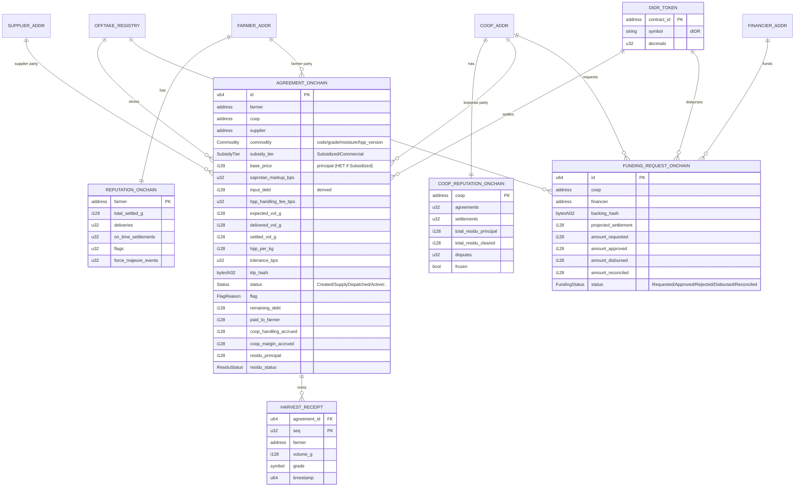

# ERD — Annona Protocol (Data Model)

> Entity-relationship model across the on-chain/off-chain boundary. On-chain entities are authoritative for amounts/status; off-chain holds PII + reference data + read-models. The `onchain_id` is the join key. Contract struct details in `./SMART-CONTRACT.md`.
>
> **v4.0 — corrected multi-party model.** Splits the old **Agrinas** super-entity into **Supplier** (input principal: catalog + dispatch + residu counterparty), **Financier** (working-capital talangan), and **Warehouse Operator** (infra, non-transacting harvest receiver). Renames `base_price_agrinas` → `base_price_supplier`. Adds the **offtake-financing** entities (`FUNDING_REQUEST` + `FUNDING_REQUEST_LINE` + on-chain mirror), the **subsidy tier** (`FARMER.subsidy_status`, catalog `price_tier`/`het_price`, `AGREEMENT.subsidy_tier`), and the off-chain **input payable** ledger (`SUPPLIER_PAYABLE`). The residu reconciliation ledger + KMP (coop) reputation are unchanged, only the counterparty is renamed to the supplier. See `./SMART-CONTRACT.md` §1a for the party model.

---

## 1. Off-chain ERD (Postgres / Supabase)

```mermaid
erDiagram
    SUPPLIER ||--o{ COOP : supplies
    SUPPLIER ||--o{ SAPROTAN_CATALOG : owns
    SUPPLIER ||--o{ RESIDU_REMITTANCE : verifies
    SUPPLIER ||--o{ SUPPLIER_PAYABLE : owed
    FINANCIER ||--o{ FUNDING_REQUEST : approves
    COOP ||--o{ FARMER : registers
    COOP ||--o{ AGREEMENT : issues
    COOP ||--|| COOP_REPUTATION_CACHE : has
    COOP ||--o{ RESIDU_REMITTANCE : remits
    COOP ||--o{ FUNDING_REQUEST : submits
    COOP ||--o{ SUPPLIER_PAYABLE : owes
    FARMER ||--o{ AGREEMENT : signs
    FARMER ||--|| REPUTATION_CACHE : has
    AGREEMENT ||--o{ AGREEMENT_INPUT : contains
    AGREEMENT ||--o{ DELIVERY : receives
    AGREEMENT ||--o| RESIDU_REMITTANCE : "principal owed via"
    AGREEMENT ||--o| SUPPLIER_PAYABLE : "accrues on dispatch"
    AGREEMENT ||--o{ FUNDING_REQUEST_LINE : "backs funding via"
    FUNDING_REQUEST ||--o{ FUNDING_REQUEST_LINE : backs
    SAPROTAN_CATALOG ||--o{ AGREEMENT_INPUT : "selected as"
    COMMODITY ||--o{ AGREEMENT : "for"
    COMMODITY ||--o{ PRICE_REF : "priced by"
    COMMODITY ||--o{ YIELD_TABLE : "estimated by"
    COMMODITY ||--o{ HARVEST_SHIPMENT : "batches"
    DELIVERY ||--o| SETTLEMENT : triggers
    COOP ||--o{ HARVEST_SHIPMENT : sends
    WAREHOUSE_OPERATOR ||--o{ HARVEST_SHIPMENT : receives
    HARVEST_SHIPMENT ||--o{ HARVEST_SHIPMENT_LINE : contains
    DELIVERY ||--o{ HARVEST_SHIPMENT_LINE : composes
    AGREEMENT ||--o{ HARVEST_SHIPMENT_LINE : traces
    FARMER ||--o{ HARVEST_SHIPMENT_LINE : traces
    COOP ||--o{ APP_USER : "staffs (kmp role)"
    SUPPLIER ||--o{ APP_USER : "staffs (supplier role)"
    FINANCIER ||--o{ APP_USER : "staffs (financier role)"

    SUPPLIER {
        uuid id PK
        string name "input principal, e.g. PT Pupuk Indonesia"
        string wallet_address "Stellar G-addr (on-chain supplier role)"
        timestamptz created_at
    }

    FINANCIER {
        uuid id PK
        string name "working-capital financier, e.g. LPDB Koperasi"
        string wallet_address "Stellar G-addr"
        numeric pool_balance "simulated/pre-funded talangan pool (display)"
        timestamptz created_at
    }

    WAREHOUSE_OPERATOR {
        uuid id PK
        string name "builds/operates gerai + gudang; assets -> Pemda/Pemdes"
        string kabupaten
        timestamptz created_at
    }

    COOP {
        uuid id PK
        uuid supplier_id FK
        string name "KMP / KDMP instance"
        string kecamatan
        string kabupaten
        string provinsi
        string wallet_address "Stellar G-addr"
        numeric prefunded_cash_balance "on-site cashflow (display)"
        timestamptz created_at
    }

    FARMER {
        uuid id PK
        uuid coop_id FK
        string name "PII - off-chain only"
        string ktp_raw "PII - hashed before anchoring"
        bytea ktp_hash "mirrors on-chain"
        string wallet_address "Stellar G-addr"
        numeric plot_area_ha
        string default_commodity_code FK
        string kecamatan
        string kabupaten
        jsonb geo "optional polygon"
        string subsidy_status "Terverifikasi e-RDKK / Belum / Non-Subsidi (from Kementan, read-only)"
        string nik_note "eligibility keyed on NIK/KTP via i-Pubers; Annona records outcome only"
        timestamptz created_at
    }

    COMMODITY {
        string code PK "GABAH/JAGUNG/KOPI"
        string name
        string unit "kg"
        int hpp_version "current Inpres no."
    }

    SAPROTAN_CATALOG {
        uuid id PK
        uuid supplier_id FK
        string code "UREA/NPK-PHONSKA/INPARI.."
        string name
        string category "pupuk/benih/pestisida/alsintan"
        string region "operational region base price applies to"
        numeric base_price_supplier "PRINCIPAL (tebus price), supplier-set, read-only to KMP"
        string price_tier "subsidi(HET) / non-subsidi(komersial)"
        numeric het_price "subsidized ceiling, when price_tier=subsidi (e.g. Urea 2250, NPK 2300)"
        bool erdkk_gated "true if selecting this item requires farmer subsidy_status=Terverifikasi"
        string source "Pupuk Indonesia/.."
        string stock_status "Tersedia/Menipis/Habis - availability signal, not a qty ledger"
        string unit_label "e.g. sak/karung/liter"
        timestamptz effective_from
    }

    AGREEMENT {
        uuid id PK
        bigint onchain_id UK "join to chain"
        uuid coop_id FK
        uuid farmer_id FK
        uuid supplier_id FK
        uuid financier_id FK "nullable, set when a funding request backs this agreement"
        string commodity_code FK
        string grade
        int moisture_bps
        numeric base_price_supplier "principal, from catalog snapshot (HET if subsidized)"
        string subsidy_tier "Subsidized/Commercial (mirror of chain)"
        int saprotan_markup_bps "KMP margin, e.g. 1000 = 10%"
        numeric input_debt "DERIVED = base * (1 + markup)"
        int hpp_handling_fee_bps "KMP handling cut, e.g. 500 = 5%"
        numeric expected_vol_g
        date expected_harvest_date "off-chain estimate captured at creation - see §3 gap note"
        numeric hpp_per_kg
        int hpp_version
        int tolerance_bps
        string status "mirror of chain (incl SupplyDispatched/Active)"
        string flag "mirror of chain"
        string residu_status "Pending/Remitted/Cleared/Disputed"
        timestamptz created_at
    }

    AGREEMENT_INPUT {
        uuid id PK
        uuid agreement_id FK
        string catalog_code FK
        numeric qty
        numeric base_price_supplier "principal snapshot"
        string price_tier "subsidi(HET)/non-subsidi(komersial) for this line"
        numeric line_total_principal
    }

    DELIVERY {
        uuid id PK
        uuid agreement_id FK
        int seq
        numeric volume_g
        string grade
        int moisture_bps
        bytea receipt_onchain_ref "tx hash"
        timestamptz delivered_at
        string flag
    }

    SETTLEMENT {
        uuid id PK
        uuid delivery_id FK
        numeric gross
        numeric handling_cut "KMP keeps"
        numeric debt_netted
        numeric principal_to_supplier "residu principal"
        numeric coop_margin "KMP keeps"
        numeric net_paid "to farmer"
        string rupiah_ref "Path A: bank/BRILink ref"
        bytea settlement_tx_hash
        timestamptz settled_at
    }

    RESIDU_REMITTANCE {
        uuid id PK
        uuid coop_id FK
        uuid supplier_id FK
        bigint agreement_onchain_id FK
        numeric principal_amount "supplier money owed"
        string bank_ref "manual transfer reference"
        string proof_url "uploaded transfer proof"
        string status "Pending/Remitted/Cleared/Disputed"
        string dispute_reason
        bytea remittance_tx_hash "on-chain confirm/dispute"
        timestamptz remitted_at
        timestamptz cleared_at
    }

    PRICE_REF {
        uuid id PK
        string commodity_code FK
        numeric hpp
        string hpp_source "Inpres 4/2026"
        numeric market_price_kabupaten
        string pihps_source
        date as_of
    }

    YIELD_TABLE {
        uuid id PK
        string commodity_code FK
        string kabupaten
        numeric avg_yield_t_per_ha
        string source "BPS/KATAM"
        int year
    }

    REPUTATION_CACHE {
        uuid farmer_id PK_FK
        int deliveries
        int on_time
        numeric total_settled_g
        int flags
        int force_majeure_events
        int score "derived"
        timestamptz synced_at "from chain"
    }

    COOP_REPUTATION_CACHE {
        uuid coop_id PK_FK
        int agreements
        int settlements
        numeric total_residu_principal
        numeric total_residu_cleared
        int disputes
        bool frozen
        int score "derived"
        timestamptz synced_at "from chain"
    }

    HARVEST_SHIPMENT {
        uuid id PK
        uuid coop_id FK "sender"
        uuid warehouse_operator_id FK "receiver, warehouse operator gudang (not the supplier)"
        string commodity_code FK
        string status "Draft/Dikirim/Diterima/Selisih"
        numeric total_volume_g "KMP-declared"
        numeric received_volume_g "warehouse-operator-confirmed, null until Diterima"
        string discrepancy_note "mandatory when status=Selisih"
        timestamptz sent_at
        timestamptz received_at
        timestamptz created_at
    }

    HARVEST_SHIPMENT_LINE {
        uuid id PK
        uuid shipment_id FK
        uuid delivery_id FK "nullable, original delivery this line traces to"
        uuid agreement_id FK
        uuid farmer_id FK "per-farmer traceability inside the batch lot"
        numeric volume_g
        string grade
        int moisture_bps "same grade + different moisture stays a separate line"
    }

    APP_USER {
        uuid id PK_FK "references auth.users"
        string email UK
        string role "kmp/supplier/financier/pemerintah"
        string display_name
        uuid coop_id FK "set when role=kmp"
        uuid supplier_id FK "set when role=supplier"
        uuid financier_id FK "set when role=financier"
        timestamptz created_at
    }

    FUNDING_REQUEST {
        uuid id PK
        bigint onchain_id UK
        uuid coop_id FK
        uuid financier_id FK
        numeric projected_settlement
        numeric amount_requested
        numeric amount_approved
        numeric amount_disbursed
        numeric amount_reconciled
        numeric coverage_ratio "DERIVED = requested / projected_settlement (display)"
        string risk_badge "derived from coop reputation + health"
        string status "mirror of chain: Requested/Approved/Rejected/Disbursed/Reconciled"
        string proof_url "uploaded Bukti Offtake packet"
        timestamptz created_at
    }

    FUNDING_REQUEST_LINE {
        uuid id PK
        uuid funding_request_id FK
        uuid agreement_id FK "a backing agreement in the proof packet"
        numeric backing_value "kg_expected_or_delivered * hpp for this agreement"
    }

    SUPPLIER_PAYABLE {
        uuid id PK
        uuid coop_id FK
        uuid supplier_id FK
        bigint agreement_onchain_id FK "the dispatch that accrued this payable"
        numeric principal_accrued "tebus price owed on dispatch"
        numeric principal_settled "reduced as residu principal is remitted on-chain"
        string status "Outstanding/Partial/Cleared"
        timestamptz accrued_at
        timestamptz cleared_at
    }
```

**Off-chain-only additions worth a note:**
- `HARVEST_SHIPMENT` / `HARVEST_SHIPMENT_LINE` — KMP → **warehouse operator's gudang** forwarding logistics (the infra receiver, not the supplier), entirely off-chain in MVP. See `SMART-CONTRACT.md` §8b for the design and the planned v3.1 on-chain dual-gate (`forward_harvest` / `confirm_harvest_receipt`, confirmed by the warehouse operator).
- `SAPROTAN_CATALOG.stock_status` / `.unit_label` — `stock_status` is a coarse availability signal (Tersedia/Menipis/Habis), deliberately **not** a numeric inventory ledger in MVP; the catalog is now fully CRUD-managed by the supplier (Oversight → Katalog screen), so the field only needs to answer "can KMP still request this," not track exact quantity.
- `FARMER.subsidy_status` (v4.0) — the e-RDKK/i-Pubers eligibility badge, **recorded, never computed** (external Kementan is the source of truth; designed as a `SubsidyEligibilityProvider` adapter). Kartu Tani is legacy (payment instrument only in 2026); verification is NIK/KTP via i-Pubers. Only the *tier that applied to a specific agreement* is anchored on-chain (`AGREEMENT_ONCHAIN.subsidy_tier`).
- `SUPPLIER_PAYABLE` (v4.0) — the off-chain input trade payable ("Utang #1"), a running accounting balance, not multi-party money movement at accrual time → off-chain, same test as `saprotan_catalog`. **Paid down by the on-chain residu remittances** (`RESIDU_REMITTANCE` / `AGREEMENT_ONCHAIN.residu_principal`); rebuildable by replaying `SupplyDispatched` (accrual) + `RemittanceCleared` (reduction) events.
- `FUNDING_REQUEST` / `FUNDING_REQUEST_LINE` (v4.0) — the offtake-financing request header cache + the backing detail whose hash is `backing_hash` on-chain (same relationship `harvest_shipment_line` has to a future `shipment_hash`, and `agreement_input` has to the on-chain snapshot). The request header mirrors the on-chain `FUNDING_REQUEST_ONCHAIN`; the lines are off-chain-only.
- `APP_USER` — Supabase Auth email+password profile backing the single `/auth` login; `role` (kmp/supplier/financier/pemerintah) routes the signed-in user to `/kmp`, `/oversight/supplier`, `/oversight/financier`, or `/oversight/pemerintah` (supplier + financier share a "Mitra" oversight shell with RBAC tabs; government separate). Replaces the earlier manual role-select at `/oversight`.

---

## 2. On-chain entities (Soroban — authoritative)



---

## 3. The on-chain ↔ off-chain join

```
AGREEMENT.onchain_id       ─────►  AGREEMENT_ONCHAIN.id
FARMER.ktp_hash            ═══════  AGREEMENT_ONCHAIN.ktp_hash    (integrity check)
FARMER.wallet_address      ─────►  AGREEMENT_ONCHAIN.farmer
COOP.wallet_address        ─────►  AGREEMENT_ONCHAIN.coop
SUPPLIER.wallet_address    ─────►  AGREEMENT_ONCHAIN.supplier
SAPROTAN_CATALOG.base_price_supplier ─► AGREEMENT_ONCHAIN.base_price  (snapshot at create; HET if subsidized)
DELIVERY.receipt_onchain_ref ─────► HARVEST_RECEIPT (tx)
RESIDU_REMITTANCE.status   ◄═════  AGREEMENT_ONCHAIN.residu_status
FUNDING_REQUEST.onchain_id ─────►  FUNDING_REQUEST_ONCHAIN.id
FUNDING_REQUEST_LINE (set) ═══════  FUNDING_REQUEST_ONCHAIN.backing_hash  (integrity check)
FINANCIER.wallet_address   ─────►  FUNDING_REQUEST_ONCHAIN.financier
REPUTATION_CACHE           ◄═════  REPUTATION_ONCHAIN            (indexer sync)
COOP_REPUTATION_CACHE      ◄═════  COOP_REPUTATION_ONCHAIN       (indexer sync)
```

**Authority rule:** for any money/volume/status value, on-chain wins. Off-chain mirrors are caches for fast reads (rebuildable from events). PII + line-item detail + bank proofs exist ONLY off-chain.

**Read-model gap, by design:** `AGREEMENT.expected_harvest_date` is the one AGREEMENT field that is **not** a chain mirror and never will be — it is an off-chain estimate captured at `create_agreement` time (KMP's best guess at when the plot will be harvested), it powers `mv_upcoming_harvest` ("Panen Minggu Ini"), and it is never a settlement input. There is no chain event to derive it from because no on-chain concept corresponds to it; unlike `status`/`flag`/`residu_status`, this column is authoritative off-chain, not a cache of anything.

**Integrity rule:** `ktp_hash` is computed off-chain, stored both places. Anyone can re-hash the off-chain KTP and compare to chain → proves the record wasn't swapped without exposing the KTP.

**Funding integrity rule:** `backing_hash` is computed off-chain over the `FUNDING_REQUEST_LINE` set (backing agreement ids + receipts). The financier (or anyone) can re-hash the off-chain proof packet and confirm the on-chain request wasn't backed by different agreements than claimed — the same pattern as `ktp_hash`.

**Split-allocation rule:** `base_price` (the tebus/principal cost, HET if the item is subsidized) is snapshotted from the catalog at `create_agreement` and locked on-chain; `input_debt` is derived on-chain from it + markup. Off-chain cannot alter the principal after the chain locks it — that is the anti-moral-hazard guarantee for the supplier's money. The state pays any subsidy differential to the supplier directly, so the coop's payable is the tebus price regardless of tier.

---

## 4. Indexer materialization (read-models)

The indexer consumes events (§7 of `SMART-CONTRACT.md`) into derived tables that back dashboards:

| Read-model | Built from | Powers |
|---|---|---|
| `mv_coop_exposure` | AgreementCreated, Settled | KMP home stat cards, outstanding debt |
| `mv_upcoming_harvest` | AgreementCreated + estimator | "Panen minggu ini" panel |
| `mv_harvest_logistics` | `harvest_shipment` / `harvest_shipment_line` (off-chain tables directly, no chain events yet — see §8b) | KMP Logistik screen (shipment history); warehouse-operator Penerimaan Hasil Panen receiving desk |
| `mv_inbound_supply` | SupplyDispatched, SupplyAccepted | KMP inbound cargo monitor (Screen F) |
| `mv_bulk_request_queue` | AgreementCreated (status=Created) | Supplier KMP bulk-request terminal (Screen M2) |
| `mv_residu_ledger` | Settled, ResiduRemitted, RemittanceCleared, RemittanceDisputed | Supplier residu reconciliation desk (Screen I); counterparty = supplier |
| `mv_funding_queue` | FundingRequested (status=Requested) | Financier approval desk (Screen P) |
| `mv_funding_portfolio` | FundingApproved, FundingDisbursed, FundingReconciled | Financier portfolio + outstanding advances (Screen P) |
| `mv_supplier_payable` | SupplyDispatched, RemittanceCleared | KMP "Utang ke Supplier" view + supplier per-coop payable |
| `mv_subsidy_distribution` | AgreementCreated grouped by subsidy_tier | Government subsidized-vs-commercial split; subsidy-leakage signal |
| `mv_flag_queue` | Flagged, ForceMajeure | Oversight flag / intervention queue |
| `mv_coop_leaderboard` | all, grouped by coop | Government multi-coop leaderboard |
| `mv_commodity_dist` | AgreementCreated | Commodity distribution chart |
| `mv_macro_production` | Settled, DeliveryRecorded, grouped by region | Government macro payout & production row (Screen G) |
| `reputation_cache` | ReputationUpdated | Farmer reputation view, badges |
| `coop_reputation_cache` | CoopReputationUpdated | KMP reputation, Supplier + Financier (risk badge) + Government trust signal |

All rebuildable by replaying events from genesis → no off-chain data loss is fatal.

**Optional (v4.1) — funding counters on coop reputation.** The financier's `risk_badge` is derived off-chain from `COOP_REPUTATION_CACHE` + health today. If the badge should be grounded on-chain, add `funding_requests` / `funding_disbursed_total` / `funding_reconciled_total` / `funding_defaults` to **both** `COOP_REPUTATION_ONCHAIN` (SC struct) and `COOP_REPUTATION_CACHE` here. Left out of the MVP struct to keep the WASM budget lean; flagged so it lands in both places if adopted.
