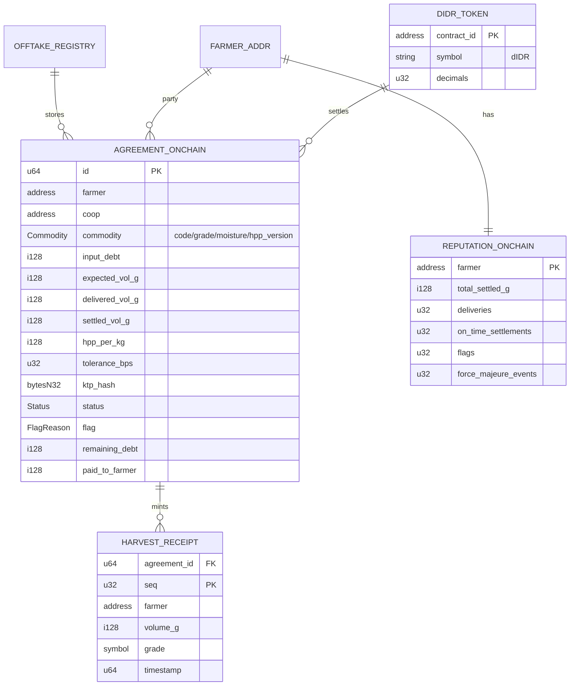

# ERD — Annona Protocol (Data Model)

> Entity-relationship model across the on-chain/off-chain boundary. On-chain entities are authoritative for amounts/status; off-chain holds PII + reference data + read-models. The `onchain_id` is the join key. Contract struct details in `./SMART-CONTRACT.md`.

---

## 1. Off-chain ERD (Postgres / Supabase)

```mermaid
erDiagram
    COOP ||--o{ FARMER : registers
    COOP ||--o{ AGREEMENT : issues
    FARMER ||--o{ AGREEMENT : signs
    FARMER ||--|| REPUTATION_CACHE : has
    AGREEMENT ||--o{ AGREEMENT_INPUT : contains
    AGREEMENT ||--o{ DELIVERY : receives
    INPUT_CATALOG ||--o{ AGREEMENT_INPUT : "selected as"
    COMMODITY ||--o{ AGREEMENT : "for"
    COMMODITY ||--o{ PRICE_REF : "priced by"
    COMMODITY ||--o{ YIELD_TABLE : "estimated by"
    DELIVERY ||--o| SETTLEMENT : triggers

    COOP {
        uuid id PK
        string name
        string kecamatan
        string kabupaten
        string provinsi
        string wallet_address "Stellar G-addr"
        timestamptz created_at
    }

    FARMER {
        uuid id PK
        uuid coop_id FK
        string name "PII - off-chain only"
        string ktp_raw "PII - hashed before anchoring"
        bytea ktp_hash "mirrors on-chain"
        string wallet_address "Stellar G-addr"
        numeric plot_area_ha
        string default_commodity_code FK
        string kecamatan
        string kabupaten
        jsonb geo "optional polygon"
        timestamptz created_at
    }

    COMMODITY {
        string code PK "GABAH/JAGUNG/KOPI"
        string name
        string unit "kg"
        int hpp_version "current Inpres no."
    }

    INPUT_CATALOG {
        string code PK
        string name "Urea/NPK Phonska/Inpari.."
        string category "pupuk/benih/pestisida/alsintan"
        numeric unit_price
        bool subsidi_flag
        string source "Pupuk Indonesia/.."
    }

    AGREEMENT {
        uuid id PK
        bigint onchain_id UK "join to chain"
        uuid coop_id FK
        uuid farmer_id FK
        string commodity_code FK
        string grade
        int moisture_bps
        numeric input_debt
        numeric expected_vol_g
        numeric hpp_per_kg
        int hpp_version
        int tolerance_bps
        string status "mirror of chain"
        string flag "mirror of chain"
        timestamptz created_at
    }

    AGREEMENT_INPUT {
        uuid id PK
        uuid agreement_id FK
        string input_code FK
        numeric qty
        numeric unit_price
        numeric line_total
    }

    DELIVERY {
        uuid id PK
        uuid agreement_id FK
        int seq
        numeric volume_g
        string grade
        int moisture_bps
        bytea receipt_onchain_ref "tx hash"
        timestamptz delivered_at
        string flag
    }

    SETTLEMENT {
        uuid id PK
        uuid delivery_id FK
        numeric gross
        numeric debt_netted
        numeric net_paid
        string rupiah_ref "Path A: bank/BRILink ref"
        bytea settlement_tx_hash
        timestamptz settled_at
    }

    PRICE_REF {
        uuid id PK
        string commodity_code FK
        numeric hpp
        string hpp_source "Inpres 4/2026"
        numeric market_price_kabupaten
        string pihps_source
        date as_of
    }

    YIELD_TABLE {
        uuid id PK
        string commodity_code FK
        string kabupaten
        numeric avg_yield_t_per_ha
        string source "BPS/KATAM"
        int year
    }

    REPUTATION_CACHE {
        uuid farmer_id PK_FK
        int deliveries
        int on_time
        numeric total_settled_g
        int flags
        int force_majeure_events
        int score "derived"
        timestamptz synced_at "from chain"
    }
```

---

## 2. On-chain entities (Soroban — authoritative)



---

## 3. The on-chain ↔ off-chain join

```
AGREEMENT.onchain_id  ─────►  AGREEMENT_ONCHAIN.id
FARMER.ktp_hash       ═══════  AGREEMENT_ONCHAIN.ktp_hash   (integrity check)
FARMER.wallet_address ─────►  AGREEMENT_ONCHAIN.farmer
DELIVERY.receipt_onchain_ref ─► HARVEST_RECEIPT (tx)
REPUTATION_CACHE      ◄═════  REPUTATION_ONCHAIN  (indexer sync)
```

**Authority rule:** for any money/volume/status value, on-chain wins. Off-chain mirrors are caches for fast reads (rebuildable from events). PII + line-item detail exist ONLY off-chain.

**Integrity rule:** `ktp_hash` is computed off-chain, stored both places. Anyone can re-hash the off-chain KTP and compare to chain → proves the record wasn't swapped without exposing the KTP.

---

## 4. Indexer materialization (read-models)

The indexer consumes events (§7 of `SMART-CONTRACT.md`) into derived tables that back dashboards:

| Read-model | Built from | Powers |
|---|---|---|
| `mv_coop_exposure` | AgreementCreated, Settled | Coop home stat cards, outstanding debt |
| `mv_upcoming_harvest` | AgreementCreated + estimator | "Panen minggu ini" panel |
| `mv_flag_queue` | Flagged, ForceMajeure | Auditor flag queue |
| `mv_coop_leaderboard` | all, grouped by coop | Auditor multi-coop leaderboard |
| `mv_commodity_dist` | AgreementCreated | Commodity distribution chart |
| `reputation_cache` | ReputationUpdated | Farmer reputation view, badges |

All rebuildable by replaying events from genesis → no off-chain data loss is fatal.
